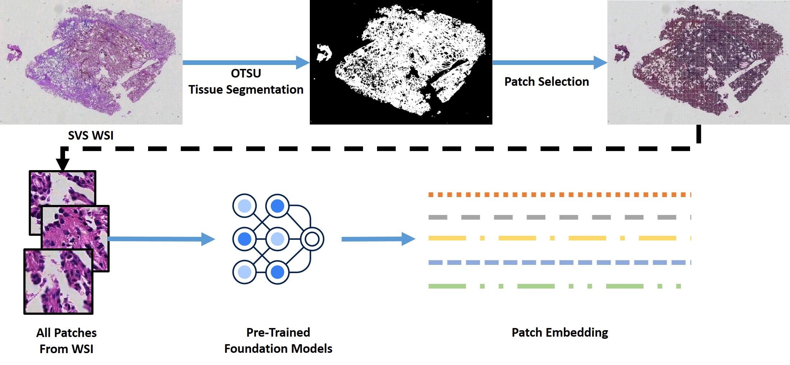
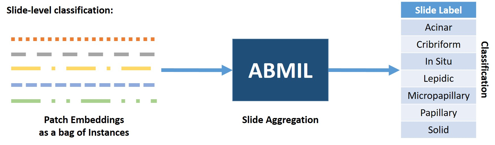
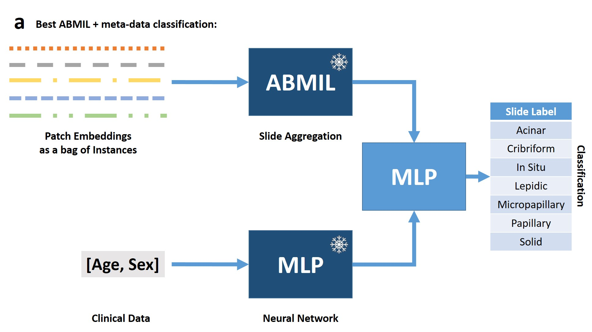

# Foundation-Model Fusion in Lung Cancer Subtyping

## Objective

Predict the **histologic growth pattern (tumor subtype)** of lung adenocarcinoma from whole-slide images (WSIs), by combining embeddings from **three different pathology foundation models** with patient metadata (age, sex).

---

## Contents

- [Project Organization](#Project-Organization)
- [Environment Setup](#Python-Environment-Setup)
- [Data Preparation](#Data-Preparation)
- [Tasks](#Tasks)
- [Results](#Results)
- [Discussion](#Discussion)
- [Future Work](#Future-Work)

## Project Organization

```
├── README.md             <- README for developers using this project and Project Report.
│
├── docs                  <- Store helpful docs and images.
│
├── artifacts             <- Store interim  that can be processed.
│
├── notebooks             <- Notebooks to process and prepare the data.
│
├── results               <- Stores the results for all the tasks on test data.
│
├── requirements.txt      <- The requirements file for reproducing the analysis environment.
│
├── environment.yml       <- To create conda virtual environment for the project.
│
├── setup_environment.py  <- A python code which setup the environment and install all the
│                            requirements (for windows).
│ 
│                                           (To run for all three folds or models combined)
├── run_all_embedding_models.py            <- Automatically run all the models to generate embeddins (for winows).
├── run_all_MIL_models.py                  <- Automatically run MIL on all the embeddings generated (for winows).
├── run_all_slide_embedding_models.py      <- Automatically aggregate and generate the slide level embedding using best MIL model (for winows).
├── run_all_bestMIL_with_Metadata.py       <- Automatically run Best MIL model with metadata (Age + Sex) combined (for winows).
│
├── scripts            <- Source code for use in this project.                         
│ 
└── src                <- Stores csv files, WSI data, embeddings, patch coordinates, thumbnails, model checkpoints etc. 

```

--------

## Python Environment Setup

Please refer to the [Environment setup guide](https://github.com/abubakr-shafique/CLWD_Agent_Embedding-Fusion/tree/main/docs/INSTALLATION.md) for detailed instructions on how to set up the environment and get started.

## Hardware Setup
All experiments were performed on the Windows platform using Python 3.11, PyTorch 2.9, and CUDA 12.8. The system was equipped with an Intel Core i9-12900K processor 64 GB of RAM, and NVIDIA RTX 3090 GPU with 24 GB of VRAM.

## Data Preparation

**Sources:** <br>
[`kmmuleelab/Lung_Pathology_Image_JPG`](https://huggingface.co/datasets/kmmuleelab/Lung_Pathology_Image_JPG) (HuggingFace) <br>
[`Pathology CLWD Image Repository SVS`](https://leelab.kmmu.edu.cn/PathologyRepository) (public) <br>
**Reference publication:** [www.nature.com/articles/s41597-026-06906-z](https://www.nature.com/articles/s41597-026-06906-z) <br>

| Property           | Value                                |
| ------------------ | ------------------------------------ |
| Whole-slide images | 408                                  |
| Patients           | 210                                  |
| Slides per patient | 1–5 (median 2)                       |
| Scan magnification | 80×                                  |
| Format             | JPG & SVS                            |
| Disease            | Lung adenocarcinoma                  |
| Label              | Histologic growth pattern, 7 classes |

**For this Implementation:**

I aim to use one slide per patient based on a deterministic rule, such as selecting the slide with the lowest `WSI_ID`. However, there are some exceptions where multiple slides per patient are retained. <br>

- There are 209 distinct patient IDs for 210 patients. Patient ID `8377886` appears twice, with ages 68 and 69 (slides WSI-35/36 and WSI-103/104). We treat these as a single patient, despite the two samples being collected one year apart, and select one sample from each age group (68 and 69). Although the samples were collected one year apart, they may still share patient-specific characteristics, potentially introducing patient-level bias or enabling the model to learn patient-specific patterns. Therefore, both samples are considered to originate from the same patient and are kept within the same data split to prevent potential information leakage between the training, validation, and test sets. <br>
- Five patients have conflicting subtype labels across their slides (e.g., `8225322`, `8240634`, `8245975`, `8248415`, and `8248805`). We include both slides with their respective labels. However, these slides are treated as belonging to the same patient and therefore must **not** be divided across different data splits (i.e., training, validation, or test). <br>

[`CLWD_Filter_Patients_one_slide.ipynb`](https://github.com/abubakr-shafique/CLWD_Agent_Embedding-Fusion/blob/main/notebooks/CLWD_Filter_Patients_one_slide.ipynb) notebook is used to filter the data for a smaller subset of the original data. ([`CLWD.csv`](https://github.com/abubakr-shafique/CLWD_Agent_Embedding-Fusion/blob/main/src/csv/CLWD.csv) > [`CLWD_OneSlide.csv`](https://github.com/abubakr-shafique/CLWD_Agent_Embedding-Fusion/blob/main/src/csv/CLWD_OneSlide.csv)) <br>

The data are divided into three folds of training (70%), validation (10%), and test (20%) sets based on the 209 unique patients using [`CLWD_Data_Stratification.ipynb`](https://github.com/abubakr-shafique/CLWD_Agent_Embedding-Fusion/blob/main/notebooks/CLWD_Data_Stratification.ipynb) notebook. Three folds have been used to perform a cross validation over three different splits of the data. <br>

[`Fold 1`](https://github.com/abubakr-shafique/CLWD_Agent_Embedding-Fusion/tree/main/src/csv/Fold_0); [`Fold 1`](https://github.com/abubakr-shafique/CLWD_Agent_Embedding-Fusion/tree/main/src/csv/Fold_1); [`Fold 2`](https://github.com/abubakr-shafique/CLWD_Agent_Embedding-Fusion/tree/main/src/csv/Fold_2); CSV files are generated with patient level stratification.

| Split      | (%)      | Patients (of 209)| Fold 0 <br> WSIs (of 215)    | Fold 1 <br> WSIs (of 215)    | Fold 2 <br> WSIs (of 215)    |
| ---------- | -------: | ----------------:| ----------------------------:| ----------------------------:|----------------------------: |
| Train      |      70% |              146 |              149             |            149               |              151             |
| Validation |      10% |               21 |               23             |            21                |              21              |
| Test       |      20% |               42 |               43             |            45                |              43              |

**Downloading the WSI Data:**
Two versions of the dataset are publicly available: compressed JPG images and whole-slide images (WSIs) in SVS format. For reliable WSI processing and analysis, metadata such as objective magnification, microns per pixel (MPP), and the image resolution at the highest-resolution level is essential. Although the JPG images are substantially smaller in file size, they do not retain the necessary acquisition metadata and appear to be incomplete with respect to both metadata and the number of available samples. <br>

Furthermore, comparison of the JPG images with their corresponding SVS files suggests that the JPG images may not represent the full-resolution images acquired at the stated 80× magnification. This limitation makes it difficult to accurately determine or reproduce a target magnification, such as 20×, which would require a four-fold downsampling from 80×. Without reliable metadata describing the original magnification, MPP, and resolution, consistent extraction of images at a specific target magnification cannot be ensured. <br>

For example: `WSI-1.svs` VS `WSI-1.jpg` 

| Metadata               |  `WSI-1.svs`        |  `WSI-1.jpg`        |
| ---------------------- | ------------------: | ------------------: |
| Vendor                 |     Aperio          |      N/A            |
| Highest Resolution     |     185472 x 126336 |     64999 x 44275   |
| Objective Power (Mag.) |      80x            |      N/A            |
| MPP                    | 0.1038319 µm/pixel  |      N/A            |
| Level count            | 8                   |      N/A            |

As the highest-resolution levels of the SVS and JPG images do not correspond, it would be inappropriate to assume that the JPG images represent the full-resolution images at 80× magnification. Furthermore, in the absence of additional acquisition information for the JPG images and the relevant SVS metadata, the objective power and corresponding physical resolution of the JPG images cannot be reliably determined. Therefore, based on this comparison, I decided to use the SVS images for this project, as they provide the necessary metadata to support informed, consistent, and reproducible image-processing and magnification-selection procedures. <br>

[`Check_WSI_metadata.ipynb`](https://github.com/abubakr-shafique/CLWD_Agent_Embedding-Fusion/blob/main/notebooks/Check_WSI_metadata.ipynb) notebook can be used to read SVS metadata. <br>
[`CLWD_download_svs.ipynb`](https://github.com/abubakr-shafique/CLWD_Agent_Embedding-Fusion/blob/main/notebooks/CLWD_download_svs.ipynb) notebook can be used to download the SVS data. `Download dir: src/data` <br>
[`hf_repo_download_CLWD.ipynb`](https://github.com/abubakr-shafique/CLWD_Agent_Embedding-Fusion/blob/main/notebooks/hf_repo_download_CLWD.ipynb) notebook can be used to download the JPG data from HuggingFace. `Download dir: src/data_jpg` *Note: this requires huggingface access token* <br>


## Tasks

### Step 1 — Feature extraction with three foundation models
**Patch Encoding:** <br>
To extract meaningful features from WSIs, the images must first be divided into smaller image tiles, as WSIs are gigapixel-scale images that cannot be efficiently processed as a whole. The initial preprocessing step involves identifying the tissue regions and excluding non-informative background areas. We performed Otsu-based tissue segmentation at the thumbnail level to efficiently generate a tissue mask and reduce the computational cost of subsequent processing. Thumbnails and Masks are stored in `src/thumbnail` directory of this project. <br>

We targeted a patch size of `224 × 224` pixels at `20×` magnification, which is compatible with a broad range of histopathology foundation models (FMs) reported in the literature. Using the generated tissue mask, candidate patches were identified at pyramid level 6 and the corresponding coordinates were appropriately scaled to level 0 (which is 64 scaling factor from level 6 to level 0). The patches were extracted at pyramid level 2, corresponding to `20×` magnification in the SVS files, using a sliding-window approach with a stride of `224` pixels, resulting in non-overlapping `224 × 224` pixel patches. To ensure that each patch contained sufficient tissue content, only patches with at least `80%` tissue coverage, as determined by the corresponding tissue segmentation mask, were retained for embedding generation. The patches were then extracted from the 20x-resolution (level 2) using the `OpenSlide` library, ensuring consistent spatial localization and target magnification across the WSIs. Patch Visualizations are stored in `src/patch_visualization` directory of this project. <br>

For feature extraction, we used pretrained histopathology FMs as a generalized representation-generation approach. All patches extracted from the WSIs were subsequently processed through the respective FMs to generate feature embeddings, which were used as the input representations for downstream analysis. Table below shows the selected FMs as the feature extractor for the patches of the WSIs. These FMs were selected based on their large-scale pretraining on millions of WSIs, as well as the diversity of the datasets used during training. Two of the selected models, **Virchow2** from Paige and **H-OPTIMUS-1** from Bioptimus, were developed by industry organizations with an emphasis on large-scale computational pathology applications. In contrast, **UNI2-h** was developed by an established academic research group. Despite differences in their development settings, all three models were pretrained on large and diverse collections of WSIs, including data sourced from multiple private hospitals. Moreover, these models have consistently demonstrated strong performance across a range of downstream computational pathology tasks, as reported in the existing literature.

**Prism2** was not included for patch embedding generation because it is primarily a **slide-level encoder**, whereas the three selected FMs (UNI2-h, Virchow2, and H-OPTIMUS-1) are **patch-level encoders**.

Generated embedding for all the patches per WSIs are saved in `src/embeddings/patch` directory of this project. The figure below shows the pipeline to process the WSI and generate the embeddings.<br>

<p align="center">
 
</p>

Histopathology Patch encoders used in this project:

| Models                                                        |  Params. (M)        |  Embedding Dim.     | Avg. time / WSI (s) |
| ------------------------------------------------------------- | ------------------: | ------------------: | ------------------: |
| [UNI2-h](https://huggingface.co/MahmoodLab/UNI2-h)            |     681             |      1536           |       722           |
| [Virchow2](https://huggingface.co/paige-ai/Virchow2)          |     632             |     1280            |       257           |
| [H-OPTIMUS-1](https://huggingface.co/bioptimus/H-optimus-1)   |      1100           |      1536           |       896           |

[`scripts/generate_embeddings.py`](https://github.com/abubakr-shafique/CLWD_Agent_Embedding-Fusion/blob/main/scripts/generate_embeddings.py) script can be used to genetare the embeddings using the following command:

```bash
python scripts/generate_embeddings.py --model_name UNI2-h
```
or all the models can run altogether using [`run_all_embedding_models.py`](https://github.com/abubakr-shafique/CLWD_Agent_Embedding-Fusion/blob/main/run_all_embedding_models.py) script on Windows with the following command:

```bash
python run_all_embedding_models.py
```

While using FMs, we have to make sure that each FMs are used as recommended by authors in their corresponding repositories and use their recommended normalization mean and standard deviation on which they have been pretrained. while `UNI2-h`, and `Virchow2` use `[mean: [0.485, 0.456, 0.406], std: [0.229, 0.224, 0.225]]` normalization mean and standard deviation, while `H-OPTIMUS-1` uses `[mean: [0.707223, 0.578729, 0.703617], std: [0.211883, 0.230117, 0.177517]]` mean and standard deviation. Model are being loaded from [`scripts/FMs/load_models.py`](https://github.com/abubakr-shafique/CLWD_Agent_Embedding-Fusion/blob/main/scripts/FMs/load_models.py) script along with their given data transform. <br> *Note: it requires huggingface access token and approval from the authors of the given FMs repository.* <br>

Embeddings can be downloaded: <br>
[`UNI2-h Embeddings`](https://drive.google.com/file/d/1gANwXbwh3Scc92ShhwbdTN8KCekJGSum/view?usp=sharing)<br>
[`Virchow2 Embeddings`](https://drive.google.com/file/d/1t4NGjA-ymhfRE4He41gUec-1fRSnY8PB/view?usp=sharing)<br>
[`UNI2-h Embeddings`](https://drive.google.com/file/d/1RVrYM2u8_059fFN0BoNe_uMo6u5ra23p/view?usp=sharing)<br>

[`Patch Coordinates`](https://drive.google.com/file/d/16wBC57Ku4Bd19CoxvZAaIKBcyof5iMwy/view?usp=sharing) <br>
[`Thumbnails & Masks`](https://drive.google.com/file/d/13QsK-V43hVHLLVwwtbld4XtfRomHcMKR/view?usp=sharing) <br>
[`Patch Visualization`](https://drive.google.com/file/d/12hipS_iqNAppvzOH_G1LEDz3QA-uuL-Q/view?usp=sharing) <br>

**Slide Encoding and Classification:** <br>
Following patch-level feature extraction, the resulting patch embeddings from each WSI are aggregated into a single slide-level representation for downstream classification of the tumour into one of seven histopathological classes. In this study, we employ an Attention-Based Multiple Instance Learning (ABMIL) framework, where each WSI is treated as a bag of patch-level instances, with the corresponding slide-level tumour subtype serving as the bag-level label. The attention mechanism enables the model to learn the relative importance of individual patches and to construct a slide-level representation that emphasizes diagnostically informative regions. <br>

ABMIL was selected over conventional mean pooling and pretrained slide-level encoders for several methodological reasons. Although mean pooling provides a simple and computationally efficient approach for aggregating patch embeddings, it assigns equal weight to all instances. This may be suboptimal for WSIs in which tumour tissue occupies only a relatively small proportion of the imaged area. In such cases, a large number of patches originating from non-tumour regions, such as connective tissue or normal adjacent tissue, may dominate the aggregated representation and dilute features associated with the tumour. In contrast, attention-based aggregation allows the model to learn instance-specific weights and thereby assign greater importance to patches that are more informative for the slide-level classification task. <br>

A second consideration is the use of pretrained slide-level encoders such as Prism2. Prism2 was fine-tuned using patch-level embeddings generated by Virchow2 and is designed to operate within this specific feature space. Consequently, its learned aggregation mechanism is optimized for Virchow2 representations and is expected to achieve its strongest performance when provided with Virchow2 patch embeddings. Applying Prism2 directly to embeddings generated by other FMs, such as UNI2-h and H-OPTIMUS-1, would therefore introduce a potential feature-space mismatch, as these models differ in both their learned representations and embedding dimensionality. Specifically, Virchow2 produces 1,280-dimensional patch embeddings, whereas UNI2-h and H-OPTIMUS-1 produce 1,536-dimensional embeddings. Using Prism2 across all three models would consequently not provide a consistent, model-independent aggregation strategy. <br>

In contrast, ABMIL can be independently trained on the patch embeddings produced by each FM, allowing the attention mechanism to adapt to the corresponding feature space while maintaining the same aggregation architecture across models. This provides a more controlled framework for comparing the slide-level representations generated by different FMs. Furthermore, the ABMIL projection layer allows the resulting slide-level embeddings to be mapped to a common 1,024-dimensional space, facilitating subsequent fusion of representations from the different FMs. <br>

This common representation facilitates subsequent multi-FM embedding fusion, in which the slide-level embeddings derived from UNI2-h, Virchow2, and H-OPTIMUS-1 can be combined without requiring additional dimensionality alignment. Thus, ABMIL serves two complementary purposes in our framework: (1) it learns an attention-weighted aggregation of variable numbers of patch-level instances into a compact slide-level representation, and (2) it maps the heterogeneous feature spaces produced by different FMs into a common 1,024-dimensional representation space suitable for downstream fusion and classification. <br>

[`scripts/MIL_wsi_encoder.py`](https://github.com/abubakr-shafique/CLWD_Agent_Embedding-Fusion/blob/main/scripts/MIL_wsi_encoder.py) script can be used to train ABMIL slide aggregator using the following command:

```bash
python scripts/MIL_wsi_encoder.py --model_name UNI2-h --mode train --fold 0  ## to train the ABMIL

python scripts/MIL_wsi_encoder.py --model_name UNI2-h --mode eval --fold 0  ## to evaluate the ABMIL
```

or all the ABMIL models can run altogether using [`run_all_MIL_models.py`](https://github.com/abubakr-shafique/CLWD_Agent_Embedding-Fusion/blob/main/run_all_MIL_models.py) script on Windows with the following command:

```bash
python run_all_MIL_models.py
```
The figure below shows the ABMIL framework for slide aggregation. <br>

<p align="center">
 
</p>

**MetaData (Sex + Age) Encoding and Classification:** <br>
To incorporate clinical information into the classification framework, patient age and sex were used as two clinical features for the prediction of seven histopathological tumour subtypes. The proposed clinical-feature classifier was implemented in two stages. In the first stage, age and sex were provided as inputs to an MLP, which was trained to predict the corresponding clinical features at the output. This initial stage was designed to learn a generalized representation of the clinical information. In the second stage, the backbone MLP layers responsible for generalized representation learning were frozen, and a classification head was added to map the learned representation to the seven tumour subtypes. This two-stage strategy enables the model to first learn a generalized representation of the clinical features and subsequently use this representation for tumour subtype classification. <br>

For preprocessing, sex was encoded as a binary categorical variable, with 0 representing female and 1 representing male. Age was represented as a normalized continuous feature using min–max normalization based on the minimum and maximum ages observed across the entire dataset (24 and 80 years, respectively). The normalized age values were therefore mapped to a range of 0–1. This normalization places the age feature on a comparable numerical scale and facilitates stable optimization during model training. <br>

The MLP consequently receives a two-dimensional input vector consisting of the normalized age and binary sex features and produces a probability distribution over the seven histopathological tumour subtypes. The two-stage implementation of the clinical-feature classifier is illustrated in Figure below.

<p align="center">
 
</p>

[`scripts/clinical_metadata_classifier.py`](https://github.com/abubakr-shafique/CLWD_Agent_Embedding-Fusion/blob/main/scripts/clinical_metadata_classifier.py) script can be used to train clinical metadata classifier using the following command:

```bash
python scripts/clinical_metadata_classifier.py --mode train --fold 0  ## to train the clinical data tumour classifier

python scripts/clinical_metadata_classifier.py --mode eval --fold 0  ## to evaluate the clinical data tumour classifier
```

or all the metadata classification folds can run altogether using [`run_all_Metadata.py`](https://github.com/abubakr-shafique/CLWD_Agent_Embedding-Fusion/blob/main/run_all_Metadata.py) script on Windows with the following command:

```bash
python run_all_Metadata.py
```

**MIL Model + MetaData (Sex + Age) Encoding and Classification:** <br>
To further improve slide-level classification performance, the best-performing MIL model identified during the slide-level evaluation was integrated with clinical metadata, specifically patient age and sex. The selected MIL aggregator was retained as a frozen slide-level feature extractor. The corresponding best-performing model checkpoints were used to generate a 1024-dimensional feature vector for each slide. These slide-level embeddings were subsequently stored in the `src/embedding/slide` directory for downstream fusion with clinical features. <br>

```bash
python scripts/generate_slide_metadata_embeddings.py --model_name H-OPTIMUS-1 --mode slide --fold 0  ## to generate slide embeddings from ABMIL model
```

In parallel, the clinical metadata were processed using the previously trained MLP-based clinical encoder. The normalized age and binary-encoded sex features were provided as inputs to the frozen MLP encoder, which generated a 384-dimensional clinical representation for each patient. These metadata embeddings were stored separately in the `src/embedding/metadata_SexAge` directory. <br>

```bash
python scripts/generate_slide_metadata_embeddings.py --model_name AgeSex_Linear --mode metadata --fold 0  ## to generate metadata embeddings from MLP representation model
```

or all the slide and metadata embedding generation models and folds can run altogether using [`run_all_slide_embedding_models.py`](https://github.com/abubakr-shafique/CLWD_Agent_Embedding-Fusion/blob/main/run_all_slide_embedding_models.py) script on Windows with the following command:

```bash
python run_all_slide_embedding_models.py
```

The resulting slide-level and clinical representations were concatenated to form a joint multimodal feature vector. This concatenated representation was then provided as input to a trainable MLP, which served as the fusion and classification head. The fusion network learns interactions between the histomorphological and clinical representations and maps the resulting joint feature space to the seven histopathological tumour subtypes. <br>

Overall, the proposed multimodal architecture consists of a frozen MIL-based slide encoder, a frozen MLP-based clinical encoder, and a trainable MLP fusion and classification head. This fusion strategy enables the model to leverage complementary information from two modalities: histomorphological features extracted from the WSI and clinical characteristics represented by patient age and sex. The overall architecture for integrating slide-level representations with clinical metadata is illustrated in Figure below.

<p align="center">
 
</p>

[`scripts/Slide_with_Metadata_classifier_embeddingsOnly.py`](https://github.com/abubakr-shafique/CLWD_Agent_Embedding-Fusion/blob/main/scripts/Slide_with_Metadata_classifier_embeddingsOnly.py) script can be used to train clinical metadata classifier using the following command:

```bash
python scripts/Slide_with_Metadata_classifier_embeddingsOnly.py --model_name H-OPTIMUS-1 --mode train --fold 0  ## to train the Slide + Clinical data tumour classifier

python scripts/Slide_with_Metadata_classifier_embeddingsOnly.py --model_name H-OPTIMUS-1 --mode eval --fold 0  ## to evaluate the Slide + Clinical data tumour classifier
```

or all the folds can run altogether using [`run_all_bestMIL_with_Metadata.py`](https://github.com/abubakr-shafique/CLWD_Agent_Embedding-Fusion/blob/main/run_all_bestMIL_with_Metadata.py) script on Windows with the following command:

```bash
python run_all_bestMIL_with_Metadata.py
```

### Task 2 — Agent System for Foundation-Model Fusion Search

**Objective:** <br>
This task builds an agent that automatically searches for an effective way to combine three pathology foundation-model embeddings with patient metadata:
```
- UNI2 embedding
- Virchow2 embedding
- H-OPTIMUS embedding
- Age and sex metadata
```
The prediction target is the seven-class lung adenocarcinoma histologic growth-pattern subtype.

**Inputs and Learned Representations:** <br>
The fusion pipeline receives four separate inputs for every patient:

```
uni2_embedding
virchow2_embedding
optimus_embedding
age_sex
```

The first three inputs are cached pathology foundation-model embeddings. Caching prevents expensive foundation-model inference from being repeated inside the fusion-search loop.
Age and sex are passed through as two clinical features. Age is normalized and sex is changed to binary categories. <br>

**Run the Fusion Agent:** <br>
The first step is to generate and store the slide-level embeddings so that the MIL aggregation model does not need to be repeatedly executed during subsequent fusion experiments. Using the checkpoints of the best-performing MIL aggregation models identified during the slide-level evaluation, slide-level embeddings are generated and saved in the `src/embedding/slide` directory.

This process can be performed using the [`generate_slide_metadata_embeddings.py`](https://github.com/abubakr-shafique/CLWD_Agent_Embedding-Fusion/blob/main/scripts/generate_slide_metadata_embeddings.py) script. The script supports the generation of both slide-level and clinical metadata embeddings. For example:

```bash
python scripts/generate_slide_metadata_embeddings.py --model_name UNI2-h --mode slide --fold 0
# Generate and save slide-level embeddings

python scripts/generate_slide_metadata_embeddings.py --model_name UNI2-h --mode metadata --fold 0
# Generate and save clinical metadata embeddings
```

The same procedure can be applied to the other FMs to generate their corresponding slide-level representations.

Once the slide-level embeddings from all FMs and the clinical metadata embeddings have been generated, the representations are consolidated into a single data dictionary to facilitate multimodal embedding fusion. This can be performed using the [`prepare_fusion_data.py`](https://github.com/abubakr-shafique/CLWD_Agent_Embedding-Fusion/blob/main/scripts/prepare_fusion_data.py) script:

```bash
python scripts/prepare_fusion_data.py --fold 0
# Prepare and combine the embeddings for fusion
```

The resulting data dictionary contains the slide-level embeddings from the three FMs, the clinical metadata representation, the corresponding slide-level labels, and the WSI identifiers:

```python
new_data_dict = {
    "uni2": (N, 1024),
    "virchow2": (N, 1024),
    "optimus": (N, 1024),
    "meta": (N, 384),
    "labels": (N,),
    "ids": (N,)
}
```

where `N` denotes the number of WSI samples. Each FM contributes a 1024-dimensional slide-level representation, while the clinical metadata consists of 384-dimensional feature vector representating age and sex. The `labels` field contains the corresponding seven-class tumour subtype labels, and `ids` contains the WSI identifiers.

Finally, the fusion experiments can be performed using the [`run_fusion_agent.py`](https://github.com/abubakr-shafique/CLWD_Agent_Embedding-Fusion/blob/main/scripts/run_fusion_agent.py) script. The fusion agent searches for an effective fusion strategy using the prepared multimodal representations:

```bash
python scripts/run_fusion_agent.py --fold 0
# Run the fusion agent to identify the best-performing fusion strategy
```

Following the fusion search, the best-performing saved model and its corresponding fusion strategy can be evaluated using:

```bash
python scripts/evaluate_best_agent_model.py --fold 0
# Evaluate the best-performing saved model and fusion strategy
```

This workflow separates embedding generation, data preparation, fusion-strategy optimization, and final model evaluation.

or all the folds can run altogether using [`run_all_agens.py`](https://github.com/abubakr-shafique/CLWD_Agent_Embedding-Fusion/blob/main/run_all_agens.py) script on Windows with the following command:

```bash
python run_all_agents.py
```

**Fusion Search Space:** <br>
The search agent evaluates several complementary ways to combine the modalities.

**1 - Early Concatenation Fusion**<br>

Early fusion combines feature vectors before classification.

1. Each pathology embedding may be L2-normalized independently.
2. Each pathology embedding may optionally be projected to a lower-dimensional learned representation.
3. Age and sex are transformed into a learned metadata embedding.
4. All embeddings are concatenated.
5. A fusion MLP produces a learned fused embedding.
6. A separate classifier maps the fused embedding to seven class logits.

The search includes early fusion with:

- No L2 normalization and no dimensionality reduction.
- Per-stream L2 normalization.
- Per-stream L2 normalization with learned projection layers.
- Follow-up projection dimensions and dropout settings when early fusion is the leading family.

L2 normalization is tested because the foundation models can produce vectors with different scales. Learned projection layers are tested because direct concatenation of high-dimensional embeddings may create too many parameters for a small patient cohort.

**2 - Late Fusion** <br>

Late fusion trains an independent classifier for each input stream and combines their predicted class scores.

The late-fusion strategies include:

- **Probability averaging:** average class probabilities across stream-specific models.
- **Logit averaging:** average the unnormalized class scores, then apply softmax.
- **Weighted voting:** assign larger weight to streams with better validation performance.
- **Stacking:** use out-of-fold predictions from base models as features for a regularized multinomial logistic-regression meta-classifier.

For stacking, out-of-fold predictions are used for the training patients. This prevents the meta-classifier from learning from overly optimistic in-sample predictions made by a base model that was trained on the same patient.

**3 - Gated Fusion** <br>

Gated fusion is the intermediate learned fusion strategy.

1. Each foundation-model embedding is projected to a shared latent dimension.
2. Age and sex are transformed to a learned embedding in the same shared dimension.
3. A gate network receives the concatenated projected streams.
4. The gate network outputs four softmax weights, one for each modality.
5. The weighted sum of the modality embeddings becomes an intermediate fused representation.
6. A fusion MLP produces the learned fused embedding.
7. A separate classifier maps the learned fused embedding to seven class logits.

Unlike unweighted late fusion, gated fusion can learn different modality weights for different patients. For example, the model may learn that one pathology embedding is more useful for some cases while metadata or a different foundation model is more useful for others.

**Agent Search Procedure:** <br>

The agent uses a structured sequential search rather than a large unguided hyperparameter sweep.

**1 - Coverage Phase** <br>

The first phase ensures that every required fusion family is tested before spending additional trials on a single approach.

The initial coverage trials include:

1. Early concatenation without L2 normalization.
2. Early concatenation with L2 normalization.
3. Early concatenation with L2 normalization and learned projection.
4. Late probability averaging.
5. Late logit averaging.
6. Late weighted voting.
7. Leakage-safe stacking.
8. Gated fusion.

This prevents the search from prematurely committing to one family without comparing it against fundamentally different fusion mechanisms.

**1 - Adaptation Phase**

After coverage is complete, the agent identifies the currently best validation result and proposes targeted follow-up trials.

If early concatenation is strongest, the agent tests additional projection sizes and stronger regularization. If a late-fusion method is strongest, the agent tests stacking and gated fusion. If gated fusion is strongest, the agent tests smaller shared representations, higher dropout, and an additional random seed.

Each proposal includes a textual reason. For example:

```text
Gated fusion leads; reduce model capacity to test whether
the gain remains under stronger regularization.
```

This makes the search policy interpretable and auditable.

**2 - Training and Within-Trial Checkpointing**

For neural strategies, the training loop evaluates validation performance after each epoch. The model state from the epoch with the highest validation balanced accuracy is restored at the end of training.

```python
if val_balanced_accuracy > best_val_balanced_accuracy:
    best_val_balanced_accuracy = val_balanced_accuracy
    best_state = copy.deepcopy(model.state_dict())
```

This means a trial is represented by its best validation epoch rather than necessarily its final epoch. This reduces the risk that later epochs overwrite a better-performing earlier state.

Optionally, the trainer can instead select the epoch with the lowest validation loss. However, the primary selection setting for this task is validation balanced accuracy because it aligns with the class-imbalanced evaluation objective.

**3 - Choosing and Saving the Best Model**

After each trial, the agent calculates validation balanced accuracy:

```python
y_pred = y_prob.argmax(axis=1)
val_balanced_accuracy = balanced_accuracy_score(y_true, y_pred)
```

The agent compares the result with the previous best trial:

```python
is_new_best = score > previous_best_score
```

If the trial is a checkpointable neural model, such as early concatenation or gated fusion, its weights are saved with:

- Trial identifier
- Fusion strategy
- Full trial configuration
- Input dimensions
- Number of classes
- Validation balanced accuracy
- Model state dictionary
- Proposal reason and trial metadata

Each neural trial has a separate checkpoint:

```text
src/agent/fusion_agent/trial_001_early_concat.pt
src/agent/fusion_agent/trial_008_gated_fusion.pt
```

When a neural trial achieves a new best validation balanced accuracy, its checkpoint is copied to:

```text
checkpoints/best_validation_model.pt
```

This file is the selected neural model for final held-out test evaluation.

The saved checkpoint contains both the model weights and enough architecture information to reconstruct the same model during evaluation:

```python
checkpoint = {
    "strategy": strategy,
    "config": configuration,
    "input_dims": dimensions,
    "val_balanced_accuracy": score,
    "model_state_dict": model_state_dict,
}
```

**Search Guardrails:** <br>

The validation partition is small, so repeatedly testing many configurations can overfit model-selection decisions to random variation in validation results. The agent uses several safeguards:

- **Fixed trial budget:** the search stops once the configured maximum number of trials is reached.
- **Coverage before adaptation:** all major fusion families are evaluated before follow-up tuning begins.
- **Minimum material improvement:** a new score must improve by at least the configured threshold to reset the no-improvement counter.
- **Patience-based stopping:** the search stops after a specified number of consecutive trials without a material validation improvement.
- **Fixed seeds:** random-number generators are seeded for reproducibility.
- **No test-set access during search:** all architecture decisions and checkpoint promotion use only training and validation data.

The decision log is written as JSON Lines. Each record includes the trial configuration, validation balanced accuracy, comparison with the previous best score, whether the trial became the new best model, and the reason the agent proposed that trial.

**Final Test Evaluation:** <br>

After the agent completes validation-based model selection, `src/agent/fusion_agent/best_validation_model.pt` is loaded once for final test evaluation.

The test evaluation script reconstructs the selected architecture from the saved strategy and configuration, loads the state dictionary, and runs inference.

```bash
python scripts/evaluate_best_agent_model.py --fold 0
```

The test results stores `results/Embedding_Fusion`:

```python
results = {
    "True_label": true_labels,
    "Pred_label": predicted_labels,
    "logits": logits,
    "fused_embed": fused_embeddings,
}
```

## Results

### Experimental Strategy

Training configurations are stored in [`scripts/config`](https://github.com/abubakr-shafique/CLWD_Agent_Embedding-Fusion/tree/main/scripts/config)

**Embedding Generation:** <br>
For patch-level feature extraction, the recommended inference settings provided by the respective foundation model authors were used to generate patch embeddings from the WSIs. This ensured that each FM was evaluated using its intended preprocessing and feature-extraction configuration. <br>

**ABMIL Training:** <br>
For training the ABMIL aggregation models for each fold, the training set was used for model optimization, while the validation set was used to monitor model performance and select the best-performing checkpoint. 

```
ABMIL Training Config:
- Optimizer: AdamW (learning rate = 1e-4, and Weight decay = 1e-4)
- learning rate scheduler: learning rate decay with $\gamma$=0.1 after every 3 iterations. (Learning rate will stop decaying at 1e-7)
- Loss: Weighted CrossEntropy Loss (weights are computed based on the training set)
- Epochs: 10
- batch size: 1
- Best Model: Either lowest loss or best validation balanced accuracy.
```

MIL config can also be accessed using [`scripts/config/MIL_config.py`](https://github.com/abubakr-shafique/CLWD_Agent_Embedding-Fusion/tree/main/scripts/config/MIL_config.py) script.
 <br>

To ensure a fair comparison across FMs, the same training configuration and optimization parameters were used for the ABMIL aggregation models operating on embeddings from all three foundation models. Thus, differences in slide-level performance can be more directly attributed to the underlying FM representations rather than differences in the ABMIL training procedure. <br>

**MetaData Training:** <br>
For the metadata-only classification model, a simple multilayer perceptron (MLP) was trained using age and sex as the input clinical features. 

```
Metadata Representation Learning and classifier Training Config:
- Optimizer: AdamW (learning rate = 1e-3, and Weight decay = 0)
- learning rate scheduler: learning rate decay with $\gamma$=0.1 after every 10 iterations. (Learning rate will stop decaying at 1e-7)
- Loss: mean squared error (MSE) for representation learning only
- Loss: Weighted CrossEntropy Loss (weights are computed based on the training set)
- Epochs: 200
- Early stopping: tolerance of 50 epochs (training breaks if no improvement in 50 epochs)
- batch size: 1
- Best Model: best validation balanced accuracy.
```

metadata config can also be accessed using [`scripts/config/metadata_classifier_config.py`](https://github.com/abubakr-shafique/CLWD_Agent_Embedding-Fusion/tree/main/scripts/config/metadata_classifier_config.py) script.
 <br>

The same training configuration and hyperparameters were applied consistently across all cross-validation folds to ensure a comparable evaluation. The model checkpoint achieving the highest validation balanced accuracy was selected as the best-performing model for each fold. Balanced accuracy was used as the model-selection criterion to account for potential class imbalance among the seven tumour subtypes. <br>

**Best MIL model + MetaData Training:** <br>
To integrate clinical metadata, consisting of age and sex, with the slide-level representation generated by the best-performing MIL model, an MLP-based fusion strategy was employed. 

```
Best ABMIL + Metadata Training Config:
- Optimizer: AdamW (learning rate = 1e-4, and Weight decay = 1e-4)
- learning rate scheduler: learning rate decay with $\gamma$=0.1 after every 3 iterations. (Learning rate will stop decaying at 1e-7)
- Loss: Weighted CrossEntropy Loss (weights are computed based on the training set)
- Epochs: 100
- Early stopping: tolerance of 50 epochs (training breaks if no improvement in 50 epochs)
- batch size: 1
- Best Model: best validation balanced accuracy.
```

slide + metadata config can also be accessed using [`scripts/config/slide_metadata_config`](https://github.com/abubakr-shafique/CLWD_Agent_Embedding-Fusion/tree/main/scripts/config/slide_metadata_config) script.
 <br>

This training procedure was performed independently for each cross-validation fold.

**Fusion Agen Training:** <br>
The fusion agent evaluates multiple model configurations to identify the best-performing strategy for integrating the slide-level and clinical representations. While the agent explores different fusion configurations and model settings. <br>

```
ABMIL (UNI2-h, Virchow2, and H-OPTIMUS-1) + Metadata Embedding Fusion Training Config:
- Optimizer: AdamW (learning rate = 1e-4, and Weight decay = 1e-4)
- learning rate scheduler: learning rate decay with $\gamma$=0.1 after every 10 iterations. (Learning rate will stop decaying at 1e-7)
- Loss: Weighted CrossEntropy Loss (weights are computed based on the training set)
- Epochs: 100
- Early stopping: tolerance of 50 epochs (training breaks if no improvement in 50 epochs)
- batch size: 16
- Best Model: best validation balanced accuracy.
```

Both the corresponding model checkpoint and its associated fusion configuration are stored for subsequent evaluation on the held-out test data. This procedure ensures that the final evaluation is performed using the fusion configuration that demonstrated the strongest validation performance. <br>

### Evaluation Metrics
The evaluation results are reported as the mean performance across three cross-validation folds for each experimental configuration. Specifically, performance is evaluated for: (1) classification using clinical metadata alone (age and sex), (2) ABMIL aggregation applied independently to embeddings from each of the three foundation models, (3) the best-performing ABMIL model combined with clinical metadata, and (4) the best-performing multimodal fusion strategy identified by the fusion agent. <br>

The results across three folds are summarized using [`notebooks/summarize_results.ipynb`](https://github.com/abubakr-shafique/CLWD_Agent_Embedding-Fusion/blob/main/notebooks/summarize_results.ipynb) notebook script.


| Configuration                               | Macro AUROC $\pm$ std. <br> [95% CI]        | Balanced acc. $\pm$ std. <br> [95% CI] |
| ------------------------------------------- | ------------------------------------------- | ---------------------------------------|
| Metadata only (age + sex)                   | 61.08 $\pm$ 3.04 <br> [53.50, 68.65]        | 23.95 $\pm$ 2.10 <br> [18.73, 29.17]   |
| UNI2-h_ABMIL                                | 86.75 $\pm$ 3.34 <br> [78.45, 95.06]        | 51.82 $\pm$ 2.65 <br> [45.22, 58.42]   |
| Virchow2_ABMIL                              | 85.32 $\pm$ 3.78 <br> [75.92, 94.71]        | 52.86 $\pm$ 8.19 <br> [32.51, 73.21]   |
| H-OPTIMUS-1_ABMIL                           | **88.24 $\pm$ 2.19 <br> [82.79, 93.69]**    | **61.81 $\pm$ 4.91 <br> [49.60, 74.02]**   |
| H-OPTIMUS-1_ABMIL + metadata (age + sex)    | **88.06 $\pm$ 3.45 <br> [79.48, 96.64]**    | **62.13 $\pm$ 1.90 <br> [57.39, 66.86]**   |
| **Fused (agent-selected) + metadata**       | **88.30 $\pm$ 3.17 <br> [80.42, 96.18]**    | **63.43 $\pm$ 4.81 <br> [51.46, 75.39]**   |

Detailed evaluation results for each cross-validation fold are provided in the [`/results`](https://github.com/abubakr-shafique/CLWD_Agent_Embedding-Fusion/tree/main/results) directory of the project. In addition to the aggregate performance metrics, the results include confusion matrices, per-class ROC curves, detailed classification reports, and class-specific sensitivity and specificity. These results provide a more comprehensive assessment of model performance across the seven tumour subtypes and enable analysis of class-level performance and potential sources of misclassification.

**Best Model:**
Among all experimental configurations evaluated, agentic Fusion model achieved the strongest overall performance in fold 2 test set. The model obtained a balanced accuracy of 68.70% and an macro-AUROC of 92.50%, representing the highest performance observed across the evaluated approaches.

```
"best_configuration": {
      "strategy": "early_concat",
      "l2_norm": false,
      "projection_dim": null,
      "hidden_dim": 384,
      "dropout": 0.3,
      "learning_rate": 0.0001,
      "weight_decay": 0.0001,
      "epochs": 100,
      "batch_size": 16,
      "seed": 42
    }
```

**Confusion Matrix**


**ROC Curves**


## Discussion
Accurate classification of lung adenocarcinoma into its seven histological subtypes remains a challenging task due to the substantial morphological heterogeneity and overlap between tumour patterns. Distinguishing these subtypes often requires recognition of subtle architectural and cytological features, while individual WSIs may contain extensive regions of non-tumour tissue and substantial intra-tumour heterogeneity. Furthermore, the relative abundance of different histological patterns can vary considerably across slides, potentially resulting in an imbalance between diagnostically informative and non-informative regions. These factors make robust slide-level classification particularly challenging and motivate the use of methods capable of selectively identifying and integrating discriminative morphological features across large numbers of tissue patches. <br>

When classification was performed using clinical metadata alone, specifically age and sex, the model achieved a mean balanced accuracy of 23.95% and an average AUROC of 61.08% across the three cross-validation folds. The relatively low balanced accuracy indicates limited discriminative capability of these clinical features for distinguishing among the seven lung adenocarcinoma subtypes. Although the AUROC suggests that the model captures some degree of class-discriminative information, the results demonstrate that age and sex alone are insufficient to reliably characterize the histological subtype. <br>

When relying on tissue morphological information extracted from the WSIs, using foundation model patch embeddings followed by ABMIL-based slide-level aggregation, substantially improved classification performance compared with the clinical-metadata-only baseline. Among the three evaluated foundation models, H-OPTIMUS-1 achieved the strongest overall performance, with a mean AUROC of 88.24% and a mean balanced accuracy of 61.81% across the three cross-validation folds. These results demonstrate that WSI-derived morphological representations provide substantially greater discriminative information for distinguishing the seven lung adenocarcinoma subtypes than age and sex alone. The strong AUROC achieved by H-OPTIMUS-1 suggests that its learned patch-level representations effectively capture morphological characteristics relevant to tumour subtype classification. <br>

Integrating clinical metadata, including age and sex, with the most informative slide-level morphological representations yielded variable performance across the cross-validation folds. The manual multimodal fusion model achieved balanced accuracies of 60.20%, 62.18%, and 64.01% for Folds 0, 1, and 2, respectively. The mean AUROC was 88.06%, which was comparable to that obtained using slide-level feature classification, indicating that the incorporation of clinical metadata did not substantially alter the overall discriminative performance of the model. The H-OPTIMUS-1 slide-level ABMIL classifier achieved balanced accuracies of 61.73%, 56.94%, and 66.77% for Folds 0, 1, and 2, respectively. Compared with slide-level classification alone, the incorporation of clinical metadata resulted in a modest reduction in performance for Folds 0 and 2, whereas Fold 1 showed an improvement, suggesting that the contribution of clinical metadata may vary across data partitions. Furthermore, the manual fusion approach demonstrated relatively consistent performance, achieving balanced accuracies above 60% across all cross-validation folds. <br>

Furthermore, an AI-based fusion agent was employed to explore multiple feature-fusion architectures and identify an optimal fusion configuration. The agent evaluated different fusion configurations using the validation set, and the configuration achieving the highest validation balanced accuracy was selected for subsequent evaluation on the held-out test set. In this fusion strategy, the ABMIL slide-level embeddings from all three foundation models (UNI2-h, Virchow2, and H-OPTIMUS-1) were combined with clinical metadata (sex and age) embedding in an attempt to improve classification performance. Across the three cross-validation folds, the resulting test balanced accuracies were 62.33%, 59.26%, and 68.70%, respectively. Compared with the corresponding manual best ABMIL + metadata classification results, an improvement in balanced accuracy was observed in Folds 0 and 2, whereas Fold 1 showed a slight decrease in performance. <br>

Although the agentic embedding-fusion strategy resulted in improvements in balanced accuracy, the AUROC remained within a similar range, with a mean AUROC of approximately 88%. The manual and agentic embedding-fusion strategies also differ in their underlying feature composition. The manual fusion approach incorporates the slide-level embeddings from the best-performing slide-level aggregator, whereas the agentic fusion strategy integrates slide-level embeddings from all three foundation models evaluated in this study (UNI2-h, Virchow2, and H-OPTIMUS-1). Furthermore, the agentic fusion strategy identified different optimal fusion architectures across the individual cross-validation folds, indicating that the most effective combination of feature representations may vary depending on the specific data partition. <br>

Overall, these findings suggest that incorporating clinical metadata through manual fusion, as well as using an agentic fusion strategy to identify an optimal combination of embeddings, can improve balanced accuracy compared with individual slide-level models. However, the magnitude and consistency of these improvements vary across cross-validation folds, while the AUROC remains within a similar range. These results highlight the potential value of multimodal fusion while also indicating that the benefits of combining multiple clinical and morphological representations should be evaluated systematically. Further investigation is warranted to quantify the incremental benefit of incorporating different clinical variables and foundation-model representations relative to single-modality approaches. Importantly, the computational and implementation costs associated with increasingly complex fusion strategies should also be considered. This would enable a more comprehensive assessment of the trade-off between the observed improvement in classification performance and the additional computational resources, model complexity, and inference requirements required to achieve these improvements.

## Future Work (with 10× the compute)
With access to substantially greater computational resources, future work could investigate domain-specific fine-tuning of self-supervised foundation models using the available lung adenocarcinoma dataset. Rather than relying exclusively on frozen, pretrained representations, self-supervised adaptation on target-domain WSIs could enable the model to learn morphological characteristics that are particularly relevant to lung adenocarcinoma and its seven histological subtypes. This may improve the domain specificity of the learned representations while reducing reliance on representations learned from heterogeneous external datasets.<br>

In addition, future studies could incorporate a broader range of clinical and pathological metadata to provide complementary information about disease characteristics, progression, and tumour severity. Beyond age and sex, incorporating clinically relevant variables, where available, could enable the model to capture associations between patient-level characteristics and histopathological patterns. Integrating such information with WSI-derived morphological representations may provide a more comprehensive multimodal characterization of the disease. <br>

Another important direction is the incorporation of multi-magnification or multi-scale representations. Histopathological features relevant to tumour subtype classification occur at different spatial scales, ranging from fine-grained cellular and nuclear morphology to larger-scale tissue architecture and growth patterns. A multi-magnification framework could therefore combine complementary information acquired at different objective magnifications, enabling the model to capture both local cytological characteristics and broader architectural patterns.<br>

The current framework uses 224 × 224-pixel patches at 20× magnification, providing a relatively localized field of view. Future experiments could investigate higher magnifications, including 40×, to capture finer cellular and nuclear features while simultaneously incorporating larger fields of view to preserve contextual and architectural information. Rather than simply increasing the magnification, an effective approach would be to jointly model high-resolution local features with lower-resolution contextual information. This could be achieved through multi-scale patch extraction, hierarchical feature aggregation, or architectures designed to integrate representations across multiple spatial resolutions.<br>

With approximately an order of magnitude increase in computational resources, these approaches could be explored systematically, including domain-specific self-supervised pretraining, multimodal clinical integration, multi-magnification feature extraction, larger fields of view, and more computationally intensive slide-level aggregation strategies. Collectively, these extensions could provide a more comprehensive assessment of whether adapting the representation-learning process to the specific morphological and clinical characteristics of lung adenocarcinoma can further improve robust seven-class subtype classification.